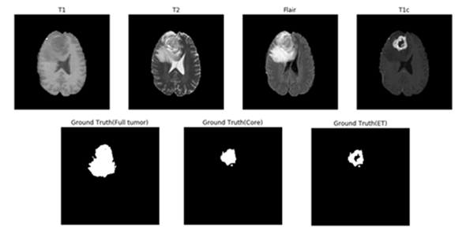

# Brain Tumor Segmentation Using U-net Model in Multi-Contrast MRI Image

## Abstract

With the huge success of deep learning in the field of computer vision, there is rising awareness of its application in medical image. Detection of brain tumor using a segmentation approach is critical in cases, where survival of a subject depends on an accurate and timely clinical diagnosis. Gliomas are the most commonly found tumors having irregular shape and ambiguous boundaries, making them one of the hardest tumors to detect. We present a fully automatic deep learning approach for brain tumor segmentation in multi-contrast magnetic resonance image. The proposed approach is based on fully convolutional network (FCN) and using U-net as the model. Using the dataset provided for the Brain Tumor Segmentation (BraTS) Challenge by the Medical Image Computing and Computer Assisted Intervention (MICCAI) society. Our proposal was validated in the BraTS2018 leaderboard dataset and achieve mean Dice Similarity Coefficient metric of 0.87 in the full tumor region, 0.76 in the tumor core region and 0.71 in the enhancing tumor region, also median Dice Similarity Coefficient metric of 0.90, 0.84, 0.80 for the full tumor, tumor core, and enhancing tumor, respectively.

## MRI Contrasts
Magnetic resonance imaging (MRI) is commonly used in medical image for analysis of brain tumors. MRI is a non-invasive system, which can be utilized alongside with other imaging modalities, such as computed tomography (CT), positron emission tomography (PET) to give accurate data for brain tumor structure. However, using these systems alongside MRI is expensive and, in some of the case, can be invasive (e.g. PET). Therefore, different MR that are non-invasive and image both structure and functions are mostly used for brain imaging. MRI machines themselves come with different configurations and produce images with varying intensities. This makes tumor detection a difficult task when different MRI configurations (such as magnetic field strength 1.5, 3 or 7 Tesla) and the acquisition protocol (field of view value, voxel resolution, gradient strength, b0 value, etc.) are used. These configurations have different intensity values across voxels, which result in the same tumorous cells may have different grayscale values when pictured in different hospitals. MRI can show different tissue contrasts through different pulse sequences, making it an adaptable and widely used imaging technique for visualizing regions of interest in the human brain. MRI modalities are combined to produce multi-modal images giving more information about irregular shaped tumors, which are difficult to localize with a single modality. These modalities include T1-weighted MRI (T1), T1-weighted MRI with contrast enhancement (T1c), T2-weighted MRI (T2) and T2-weighted MRI with fluid attenuated inversion recovery (T2-Flair). This multi-modal data contains information that can be used for tumor segmentation with significant improvement in performance.
Figure 1 shows an axial slice of the four standard sequences for a glioma patient including manually drawn tumor regions. T1-weighting is the most commonly used sequence for the structural analysis; it also allows for an easy annotation of the healthy tissues. In T1-weighted contrast-enhanced images (gadolinium-DTPA), the tumor borders appear brighter because the contrast agent accumulates there due to the disruption of the blood–brain barrier in the proliferative tumor region. In this sequence, the necrotic and the active tumor region can be distinguished easily. In T2-weighted MRI, the edema region, which surrounds the tumor, appears bright. T2FLAIR (FLAIR) is a special sequence, which helps in separating the edema region from the cerebrospinal fluid (CSF) because the free water signal is suppressed. The radiological definition of the tumor margins in the clinical context are often manually determined by the radiologist on the T2 and post-gadolinium T1 images by thresholding boundaries between T2 hyperintense/T1 contrast-enhanced lesions and the surrounding healthy tissue to define the outer margins of a tumor.

  
<b>Figure 1: </b> One axial slice of an MR image of a high-grade glioma patient. From left to right in row 1: T1-weighted image, T2-weighted image, T2-FLAIR-weighted image T1-weighted image with contrast enhancement. In row 2, showing the three sub-region ground truth labeled by exports.  

