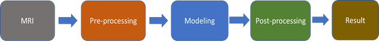
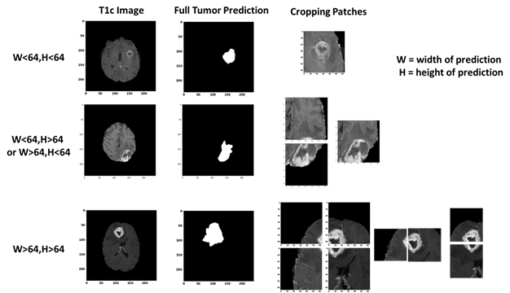
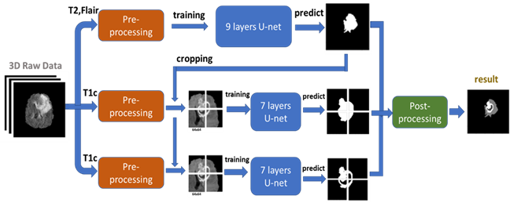

# Brain Tumor Segmentation Using U-net Model in Multi-Contrast MRI Image

## Abstract

With the huge success of deep learning in the field of computer vision, there is rising awareness of its application in medical image. Detection of brain tumor using a segmentation approach is critical in cases, where survival of a subject depends on an accurate and timely clinical diagnosis. Gliomas are the most commonly found tumors having irregular shape and ambiguous boundaries, making them one of the hardest tumors to detect. We present a fully automatic deep learning approach for brain tumor segmentation in multi-contrast magnetic resonance image. The proposed approach is based on fully convolutional network (FCN) and using U-net as the model. Using the dataset provided for the Brain Tumor Segmentation (BraTS) Challenge by the Medical Image Computing and Computer Assisted Intervention (MICCAI) society. Our proposal was validated in the BraTS2018 leaderboard dataset and achieve mean Dice Similarity Coefficient metric of 0.87 in the full tumor region, 0.76 in the tumor core region and 0.71 in the enhancing tumor region, also median Dice Similarity Coefficient metric of 0.90, 0.84, 0.80 for the full tumor, tumor core, and enhancing tumor, respectively.

## MRI Contrasts
Magnetic resonance imaging (MRI) is commonly used in medical image for analysis of brain tumors. MRI is a non-invasive system, which can be utilized alongside with other imaging modalities, such as computed tomography (CT), positron emission tomography (PET) to give accurate data for brain tumor structure. However, using these systems alongside MRI is expensive and, in some of the case, can be invasive (e.g. PET). Therefore, different MR that are non-invasive and image both structure and functions are mostly used for brain imaging. MRI machines themselves come with different configurations and produce images with varying intensities. This makes tumor detection a difficult task when different MRI configurations (such as magnetic field strength 1.5, 3 or 7 Tesla) and the acquisition protocol (field of view value, voxel resolution, gradient strength, b0 value, etc.) are used. These configurations have different intensity values across voxels, which result in the same tumorous cells may have different grayscale values when pictured in different hospitals. MRI can show different tissue contrasts through different pulse sequences, making it an adaptable and widely used imaging technique for visualizing regions of interest in the human brain. MRI modalities are combined to produce multi-modal images giving more information about irregular shaped tumors, which are difficult to localize with a single modality. These modalities include T1-weighted MRI (T1), T1-weighted MRI with contrast enhancement (T1c), T2-weighted MRI (T2) and T2-weighted MRI with fluid attenuated inversion recovery (T2-Flair). This multi-modal data contains information that can be used for tumor segmentation with significant improvement in performance.
Figure 1 shows an axial slice of the four standard sequences for a glioma patient including manually drawn tumor regions. T1-weighting is the most commonly used sequence for the structural analysis; it also allows for an easy annotation of the healthy tissues. In T1-weighted contrast-enhanced images (gadolinium-DTPA), the tumor borders appear brighter because the contrast agent accumulates there due to the disruption of the blood–brain barrier in the proliferative tumor region. In this sequence, the necrotic and the active tumor region can be distinguished easily. In T2-weighted MRI, the edema region, which surrounds the tumor, appears bright. T2FLAIR (FLAIR) is a special sequence, which helps in separating the edema region from the cerebrospinal fluid (CSF) because the free water signal is suppressed. The radiological definition of the tumor margins in the clinical context are often manually determined by the radiologist on the T2 and post-gadolinium T1 images by thresholding boundaries between T2 hyperintense/T1 contrast-enhanced lesions and the surrounding healthy tissue to define the outer margins of a tumor.

  
<b>Figure 1: </b> One axial slice of an MR image of a high-grade glioma patient. From left to right in row 1: T1-weighted image, T2-weighted image, T2-FLAIR-weighted image T1-weighted image with contrast enhancement. In row 2, showing the three sub-region ground truth labeled by exports.  

## Method
  
<b>Figure 2: </b> The overview of the proposed approach for brain tumor segmentation.  

At first, we use only one U-net model to do three different segmentation tasks (Full Tumor, Tumor Core, Enhancing Tumor), the result of full tumor is promising but the rest of two is not good. We find out that the problem is because the tumor core and enhancing tumor are too small compare to the whole brain, which means the pixel number of these two labels are too little (average 0.75% for tumor core and 0.45% for enhancing tumor per slice). Therefore, the data imbalanced problem cause that model tend to predict “no tumor” but still can get good result. According to Figure 1, we knew that tumor core must be inside of edema, and enhancing tumor is part of tumor core. To solve the problem, we use the advantage of full tumor prediction and calculating the center point of full tumor, then use the center point to crop out the training data for tumor core and enhancing tumor (shown in Figure 3). The number of cropping depend on the size of full tumor and we even crop the overlap part to do data-augmentation, cropping size is 64x64 fixed. After cropping, the ratio of tumor core and enhancing tumor have achieved average 12.7% and 7.6% per training patch.

  
<b>Figure 3: </b> The cropping method we proposed for improving the performance of tumor core and enhancing tumor segmentation. Cropping the T1c image according to center point of full tumor prediction. The patch size is 64x64 and if the tumor size is bigger than 64x64, we crop more than 1 patch.  

Then we put the 64x64 training data into another U-net model to train and predict. The result of tumor core prediction and enhancing tumor prediction will be paste back to original full tumor prediction according the center point we got. Fig. 3-3 present the flowchart of the proposed approach.  Instead of using all MRI modalities as, we only use T2 and Flair data for full tumor segmentation and only T1ce for tumor core/enhancing tumor segmentation to accelerate training. According to, to those radiologists, the edema was segmented primarily from T2 images and FLAIR was used to cross-check the extension of the edema and discriminate it against ventricles and other fluid-filled structures. Tumor core and enhancing tumor was both segmented by evaluating hyper-intensities in T1ce images.

  
<b>Figure 4: </b> we use T2 and Flair image (after pre-processing) as input to a 9 layers U-net (describe in section 3-2) for full tumor segmentation. Then using the full tumor prediction to crop out the training patches from T1c image (after pre-processing). These training patches are put in to two 7 layers U-net (describe in section 3-2) for tumor core segmentation and enhancing tumor segmentation. Then we combine all three predictions by post-processing and getting final results.  

